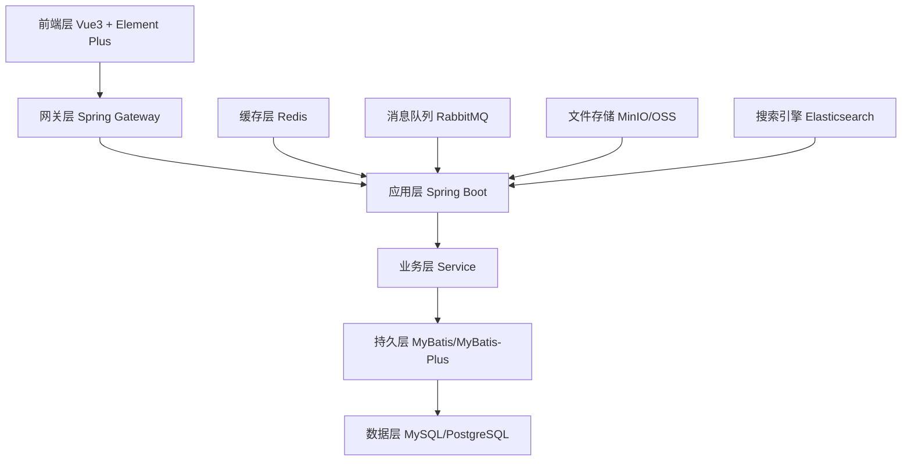
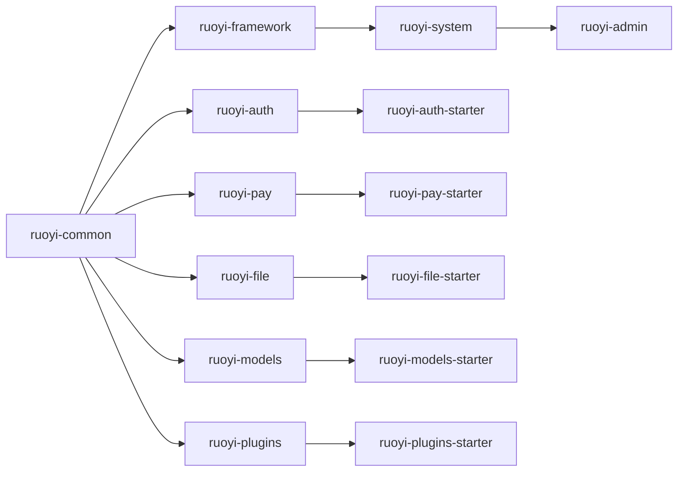
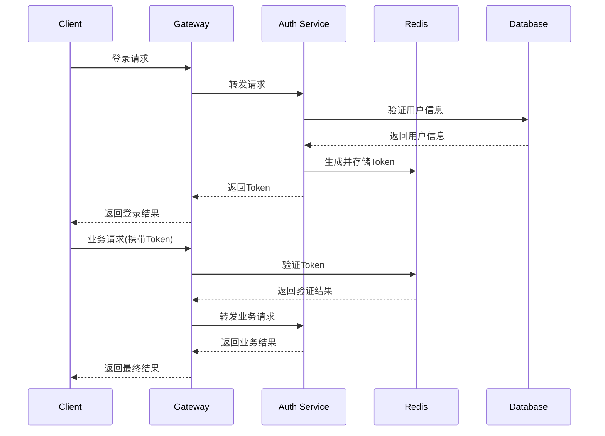

# 项目架构文档

## 技术架构图



## 模块依赖关系



## 数据库设计

### 核心表结构

1. **用户相关表**
   - `sys_user` - 用户信息表
   - `sys_role` - 角色信息表
   - `sys_user_role` - 用户角色关联表
   - `sys_dept` - 部门信息表

2. **权限相关表**
   - `sys_menu` - 菜单权限表
   - `sys_role_menu` - 角色菜单关联表
   - `sys_role_dept` - 角色部门关联表

3. **系统相关表**
   - `sys_dict_type` - 字典类型表
   - `sys_dict_data` - 字典数据表
   - `sys_config` - 参数配置表
   - `sys_logininfor` - 登录日志表
   - `sys_oper_log` - 操作日志表

### 业务扩展表

1. **支付相关表**
   - `pay_order` - 支付订单表
   - `pay_channel` - 支付渠道表
   - `pay_notify` - 支付通知表

2. **认证相关表**
   - `auth_user` - 第三方用户表
   - `auth_social` - 社交登录表
   - `auth_phone` - 手机认证表

3. **文件相关表**
   - `sys_file` - 文件信息表
   - `sys_file_part` - 文件分片表

## 安全架构

### 认证流程



### 权限控制

1. **基于角色的访问控制(RBAC)**
   - 用户 → 角色 → 权限
   - 支持多角色分配
   - 动态权限验证

2. **数据权限控制**
   - 全部数据权限
   - 自定义数据权限
   - 部门数据权限
   - 部门及以下数据权限
   - 仅本人数据权限

3. **注解驱动权限验证**
   ```java
   @PreAuthorize("@ss.hasPermi('system:user:list')")
   @DataScope(deptAlias = "d", userAlias = "u")
   ```

## 性能优化

### 缓存策略

1. **多级缓存**
   - L1缓存：JVM本地缓存
   - L2缓存：Redis分布式缓存
   - L3缓存：数据库查询缓存

2. **缓存更新策略**
   - 主动更新：业务操作后主动清理缓存
   - 被动更新：缓存过期后重新加载
   - 延时双删：解决缓存一致性问题

### 数据库优化

1. **分库分表**
   - 按业务垂直分库
   - 按数据量水平分表
   - 支持读写分离

2. **索引优化**
   - 合理设计索引
   - 避免全表扫描
   - 定期分析慢查询

3. **连接池优化**
   - Druid连接池配置
   - 连接池监控
   - 连接泄漏检测

## 监控与运维

### 系统监控

1. **应用监控**
   - JVM性能监控
   - 应用指标采集
   - 自定义指标上报

2. **基础设施监控**
   - 服务器资源监控
   - 数据库性能监控
   - Redis集群监控

3. **业务监控**
   - 接口调用监控
   - 业务异常监控
   - 用户行为分析

### 日志管理

1. **日志分类**
   - 系统日志：应用运行日志
   - 业务日志：业务操作日志
   - 访问日志：用户访问日志
   - 错误日志：异常错误日志

2. **日志收集**
   - 基于Logback的日志框架
   - 支持多种输出格式
   - 异步日志写入

3. **日志分析**
   - 支持日志搜索
   - 日志统计分析
   - 异常告警机制

## 部署架构

### 单机部署

```
┌─────────────────────┐
│     Load Balancer   │
└─────────┬───────────┘
          │
┌─────────▼───────────┐
│   Application       │
│   - Spring Boot     │
│   - Vue3 Static     │
└─────────┬───────────┘
          │
┌─────────▼───────────┐
│   Database          │
│   - MySQL/PostgreSQL│
│   - Redis           │
└─────────────────────┘
```

### 集群部署

```
┌─────────────────────┐
│     Load Balancer   │
└─────┬───────┬───────┘
      │       │
┌─────▼───┐ ┌─▼───────┐
│  App 1  │ │  App 2  │
└─────┬───┘ └─┬───────┘
      │       │
┌─────▼───────▼───────┐
│   Database Cluster  │
│   - MySQL Master    │
│   - MySQL Slave     │
│   - Redis Cluster   │
└─────────────────────┘
```

### 微服务部署

```
┌─────────────────────┐
│     API Gateway     │
└─────┬───────┬───────┘
      │       │
┌─────▼───┐ ┌─▼───────┐
│User Svc │ │Auth Svc │
└─────┬───┘ └─┬───────┘
      │       │
┌─────▼───┐ ┌─▼───────┐
│Pay Svc  │ │File Svc │
└─────┬───┘ └─┬───────┘
      │       │
┌─────▼───────▼───────┐
│   Shared Services   │
│   - Database        │
│   - Redis           │
│   - Message Queue   │
└─────────────────────┘
```

## 开发规范

### 代码规范

1. **Java代码规范**
   - 遵循阿里巴巴Java开发规范
   - 使用统一的代码格式化配置
   - 强制使用CheckStyle检查

2. **前端代码规范**
   - 遵循Vue3官方风格指南
   - 使用ESLint进行代码检查
   - 使用Prettier进行代码格式化

3. **数据库规范**
   - 统一的命名规范
   - 必要的索引设计
   - 完整的字段注释

### 开发流程

1. **需求分析**
   - 需求文档编写
   - 技术方案设计
   - 代码评审

2. **开发阶段**
   - 功能开发
   - 单元测试
   - 集成测试

3. **测试阶段**
   - 系统测试
   - 性能测试
   - 安全测试

4. **发布阶段**
   - 预发布验证
   - 生产发布
   - 上线监控

## 扩展指南

### 自定义模块开发

1. **模块结构**
   ```
   ruoyi-custom/
   ├── src/main/java/
   │   └── com/ruoyi/custom/
   │       ├── controller/
   │       ├── service/
   │       ├── domain/
   │       └── mapper/
   ├── src/main/resources/
   │   └── mapper/
   └── pom.xml
   ```

2. **配置文件**
   ```yaml
   # application-custom.yml
   custom:
     enable: true
     config:
       key: value
   ```

3. **启动器集成**
   ```java
   @Configuration
   @ConditionalOnProperty(prefix = "custom", name = "enable", havingValue = "true")
   public class CustomAutoConfiguration {
       // 自动配置逻辑
   }
   ```

### 插件开发

1. **插件接口**
   ```java
   public interface Plugin {
       void init();
       void start();
       void stop();
       void destroy();
   }
   ```

2. **插件配置**
   ```java
   @Configuration
   @EnableConfigurationProperties(PluginProperties.class)
   public class PluginConfiguration {
       // 插件配置
   }
   ```

3. **插件加载**
   ```java
   @Component
   public class PluginManager {
       public void loadPlugin(String pluginName) {
           // 插件加载逻辑
       }
   }
   ```