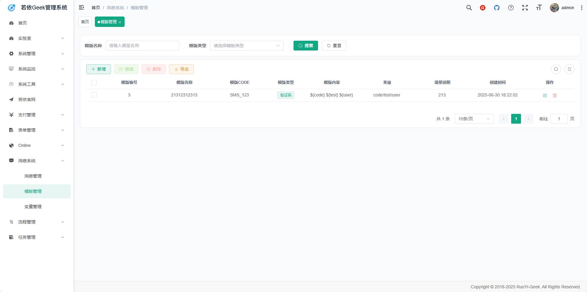
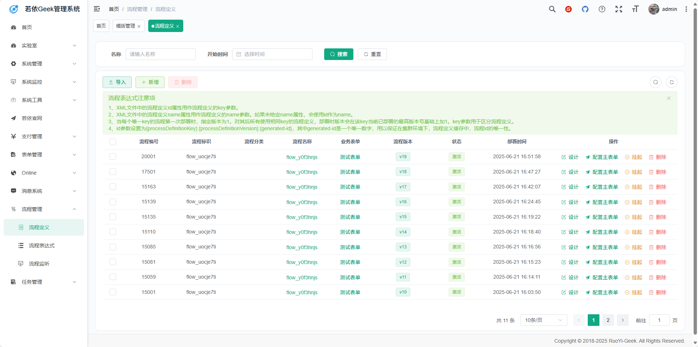
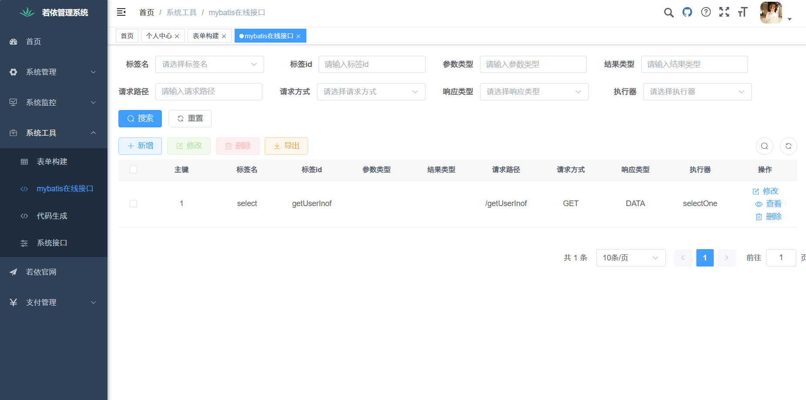
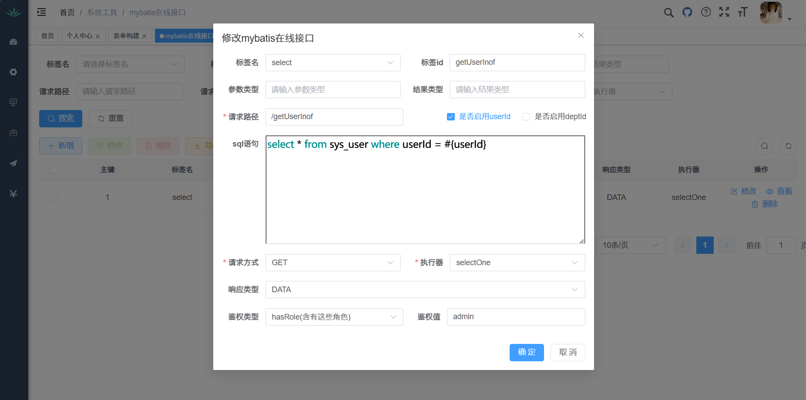
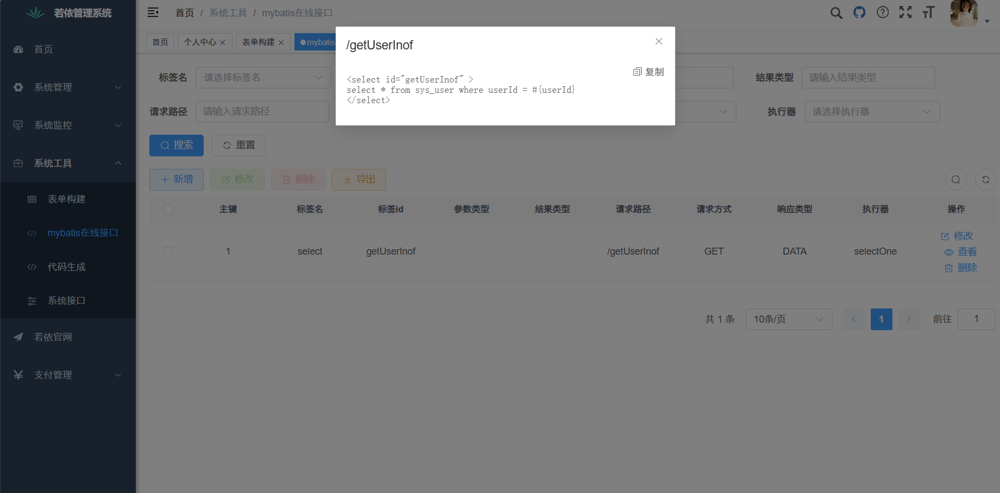
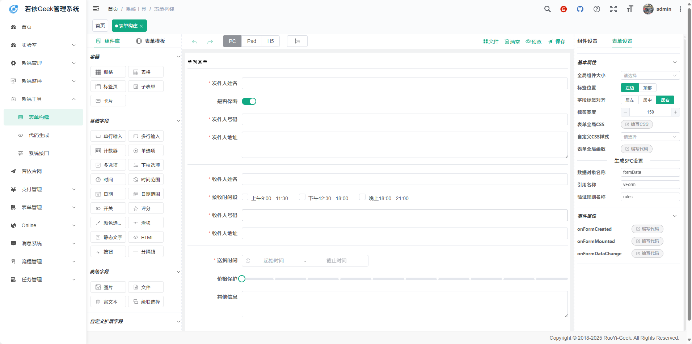
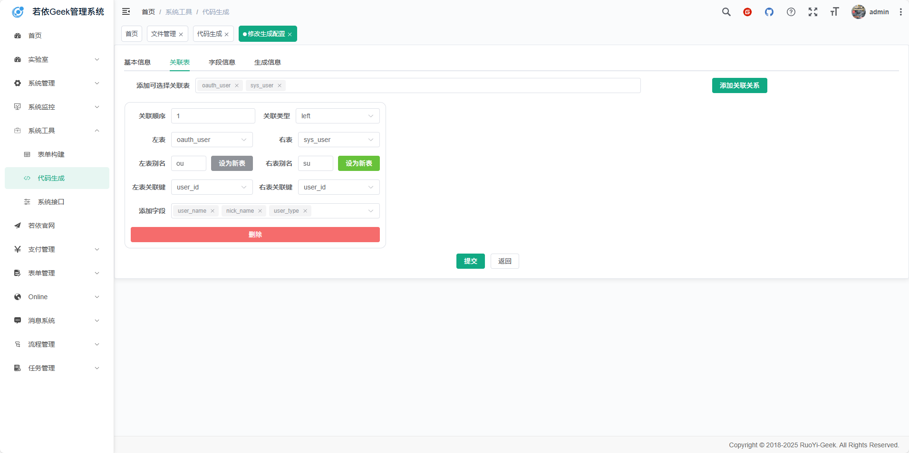
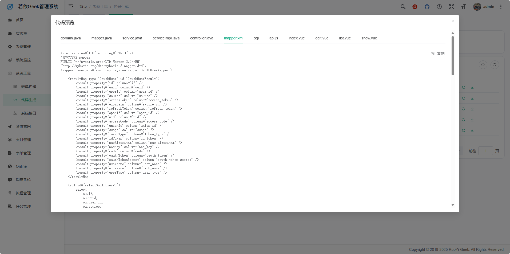

<p align="center">
    <span>
        
    </span>
    <span>+</span>
    <span>
        
    </span>
</p>
<h1 align="center" style="margin: 30px 0 30px; font-weight: bold;">geek-Geek v3.8.9-G</h1>
<h4 align="center">基于SpringBoot3+Vue3前后端分离的Java快速开发框架</h4>
<p align="center">
	
</p>

# 当前版本是3.8.9-G

本人的其他两个推荐搭配的项目

1. [geek-App-Geek: 这是极客生态的小程序版本 (gitee.com)](https://gitee.com/geek-xd/geek-uniapp-vue3-uview-plus-uchart)
2. [geek-Vue3-Geek: 这是极客生态的Vue3版本 (gitee.com)](https://gitee.com/geek-xd/ruo-yi-vue3-geek)

与本项目同为一个作者开发，兼容性最好，学习成本最低。

# 引言

geek-Vue与geek-App是基于SpringBoot2+Vue2打造的企业级开发框架，得到了广大开发者的喜爱和积极反馈。随着技术的迭代进步，SpringBoot3与Vue3逐渐进入开发者的视野。为了满足开发者对于新技术的追求，Geek官方文档提供了SpringBoot2至SpringBoot3的升级方法。与此同时，社区也涌现出了geek-Vue3、geek-App-Vue3的版本，展现了开发者社区对于技术升级的热情与努力。

然而，在升级的过程中，官方的方法为了兼顾Java1.8的特性与一些老旧的方法，未完全拥抱SpringBoot3与Java17的全部特性。而社区的geek-Vue3、geek-App-Vue3版本由于出自不同的团队之手，兼容性及整合性上存在些许不足。更为关键的是，尽管这些版本支持TypeScript，但缺乏与之相匹配的tsconfig.json配置文件，这使得在主流编辑器如VSCode中，TypeScript的语法提示环境并未达到最佳状态。

鉴于此，geek-Geek生态应运而生。它旨在为广大开发者提供一个既保留原版本核心特性，又整合社区版优点的全新解决方案。在geek-Geek中，我们深入调研了企业开发中常用的Geek扩展，并直接在框架中集成，确保开发者能够快速上手，高效开发。同时，我们采用了最新的SpringBoot3+Vue3技术栈，彻底移除了为了兼容Java1.8而保留的老旧方法。更为重要的是，我们为TypeScript开发环境加入了常用的tsconfig.json配置，使得开发者在VSCode等编辑器中能够获得更为舒适、便捷的语法提示体验。

geek-Geek不仅仅是一个简单的升级版本，更是对于Geek生态的一次全面优化与整合。我们相信，通过geek-Geek，开发者将能够更为高效、愉悦地开发出优秀的企业级应用。

## 平台简介

极客是一套全部开源的快速开发平台，毫无保留给个人及企业免费使用。

* 前端采用Vue3、Element Plus。
* 后端采用Spring Boot3、Spring Security、Redis & Jwt。
* 权限认证使用Jwt，支持多终端认证系统。
* 支持加载动态权限菜单，多方式轻松权限控制。
* 高效率开发，使用代码生成器可以一键生成前后端代码。
* 多数据源与分库分表默认集成
* 所有非基本模块可随意插拔，让开发更加简单高效
* 提供了多个工具模块助力开发，如：在线接口模块、mybatis-jpa模块
* 提供了多个常见业务模块简化开发，如：第三方认证模块、支付模块
* 提供了多个常见的服务模块集成开发，如：websocket模块、minio模块
* 特别鸣谢：[element](https://github.com/ElemeFE/element)，[vue-element-admin](https://github.com/PanJiaChen/vue-element-admin)，[eladmin-web](https://github.com/elunez/eladmin-web)。
* 阿里云折扣场：[点我进入](http://aly.geek.vip)，腾讯云秒杀场：[点我进入](http://txy.geek.vip)&nbsp;&nbsp;
* 阿里云优惠券：[点我领取](https://www.aliyun.com/minisite/goods?userCode=brki8iof&share_source=copy_link)，腾讯云优惠券：[点我领取](https://cloud.tencent.com/redirect.php?redirect=1025&cps_key=198c8df2ed259157187173bc7f4f32fd&from=console)&nbsp;&nbsp;

## 本项目与原项目的区别

### 核心

**模块化架构设计，支持各个模块的快速安拆，对第三方认证、第三方支付模块设计了基础的规范和基础模块。**

### 细节

1. 改用SpringBoot3+java17的更新的技术栈并改掉所有的弃用的方法，全面拥抱java17的全新特性。
2. 升级了代码生成器（配合本项目的vue3版本才可用），使关联表生成更加简单！
3. 改用最新版本的SpringSecurity安全框架，以及采用最新的lambda 表达式的配置方式，更加通俗易懂！
4. 自动Api文档以springfox替代springdoc来适配knife4j框架的4.x版本，更好的适配springboot3！
5. 默认引入mybatis-plus增强mybatis，并自创工具模块mybatis-jpa简化CRUD！
6. 默认引入lombok简化代码（注：基础模块并未使用mybatis-plus和lombok，对这两个扩展有争议的小伙伴可以直接删除，不会影响到框架本身滴，以及knife4j直接删除也不会影响到springdoc，主要还是为了方便咱们开发者呢！）
7. 提供了大量可随意插拔的模块，助力快速开发！同时geek插件集成中的常用插件也以模块的形式直接集成在了项目中，也是可以随意插拔的嗷~

## 模块介绍（简单开发必看）

* 最简单的开发就是删除所有的可移除模块，按需添加模块。
* 测试中的模块请自己使用的时候一定要测试一下。
* 对于小白，开发中的模块请直接删除。

```plaintext
com.geek   
├── geek-admin             // 后台服务
├── common                  // 工具类
│       └── annotation                    // 自定义注解
│       └── config                        // 全局配置
│       └── constant                      // 通用常量
│       └── core                          // 核心控制
│       └── enums                         // 通用枚举
│       └── exception                     // 通用异常
│       └── filter                        // 过滤器处理
│       └── utils                         // 通用类处理
├── framework               // 框架核心
│       └── aspectj                       // 注解实现
│       └── config                        // 系统配置
│       └── datasource                    // 数据权限
│       └── interceptor                   // 拦截器
│       └── manager                       // 异步处理
│       └── security                      // 权限控制
│       └── web                           // 前端控制
├── geek-system             // 系统代码
```

## 功能插件如何引入

1. 拉取项目到指定目录（也可以使用./geek.sh工具）
2. 在根pom.xml中添加对应的子模块声明
    ```xml
        <module>geek-modules/geek-module-quartz</module>
    ```
3. 在admin的pom.xml中添加对应的依赖
    ```xml
        <dependency>
            <groupId>com.geekxd</groupId>
            <artifactId>geek-module-quartz</artifactId>
            <version>${geek.version}</version>
        </dependency>
    ```


## 演示图

### 新加功能和增强功能演示

<table>
    <tr>
        <td></td>
        <td></td>
    </tr>
    <tr>
        <td></td>
        <td></td>
    </tr>
    <tr>
        <td></td>
        <td></td>
    </tr>
    <tr>
        <td></td>
        <td></td>
    </tr>
</table>

### 原有功能演示

<table>
    <tr>
        <td></td>
        <td></td>
    </tr>
    <tr>
        <td></td>
        <td></td>
    </tr>
    <tr>
        <td></td>
        <td></td>
    </tr>
	<tr>
        <td></td>
        <td></td>
    </tr>	 
    <tr>
        <td></td>
        <td></td>
    </tr>
	<tr>
        <td></td>
        <td></td>
    </tr>
	<tr>
        <td></td>
        <td></td>
    </tr>
    <tr>
        <td></td>
        <td></td>
    </tr>
</table>

# 联系我们：

QQ交流群：744785891
